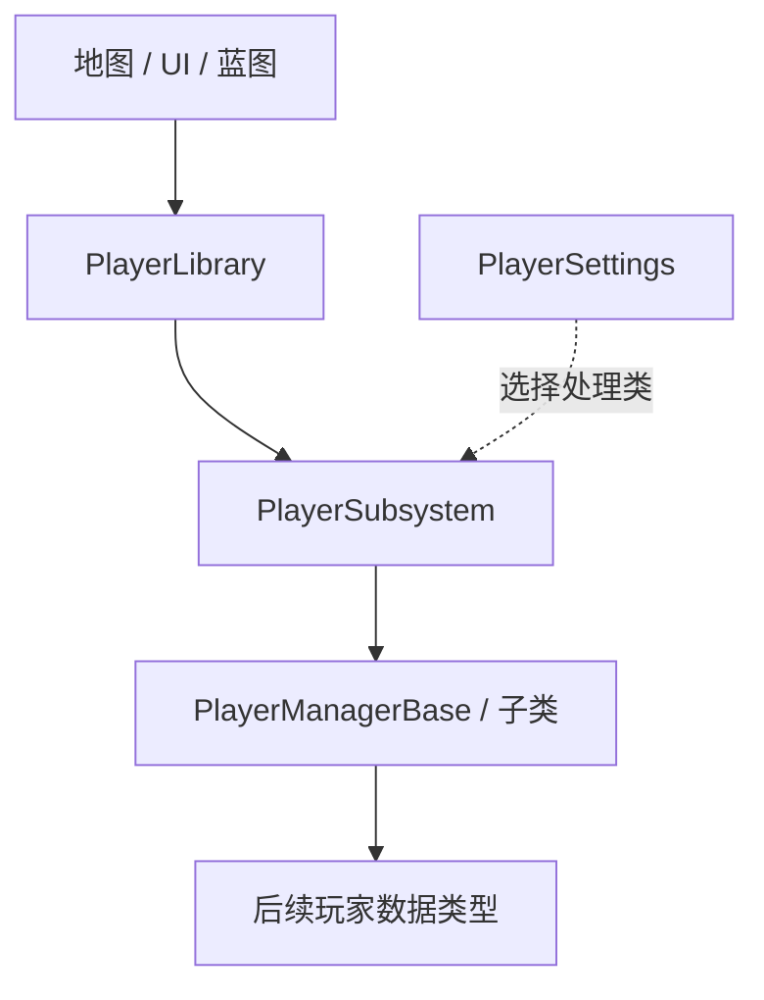

# SilverChoir C++ 分层约定

## 目录与依赖方向

游戏逻辑使用 `SilverChoir` Runtime 模块，通过目录和调用边界分层。
另有 `SilverChoirEditor` Editor 模块存放蓝图资源生成和校验工具，Runtime 不依赖它。
头文件放在 `Public`，实现放在 `Private` 的对应目录。

| 层 | 建议目录 | 职责与依赖 |
| --- | --- | --- |
| 地图与表现层 | `Map/`、`UIBasic/` | Character、Controller、Actor、地图 UI 和可复用控件；通过 Library 或 Subsystem 发起业务操作 |
| 系统层 | `SubSystem/<Name>SubSystem/` | Library、Subsystem、Settings、ManagerBase 四类协作 |
| 数据层 | `Data/Structs/`、`Data/Enums/`、`Data/Assets/` | 共享结构体、枚举、数据资产；不依赖地图、UI 或系统实例 |

目前落地 `SubSystem/PlayerSubSystem`、`UIBasic` 和 `Map/MainMenu`。
`UIBasic` 放可复用的原生基础控件，`Map/MainMenu` 定义菜单地图基类和关键控件绑定。
具体界面布局、GameMode 和 Controller 配置在 `/Game/System/Map/MainMenu` 的蓝图中完成；接入说明见 `MainMenuUI.md`。
系统层可依赖数据层，不引用具体 Widget、关卡蓝图或地图角色子类。
表现层订阅系统事件来更新 UI。系统间通过公开 API 协作，不直接修改对方处理类的数据；
存在初始化顺序要求时，使用 `Collection.InitializeDependency<>()` 并避免循环依赖。

## 玩家系统的四类文件

| 文件（均有对应 `.h/.cpp`） | 类型 | 职责 |
| --- | --- | --- |
| `PlayerLibrary` | `UBlueprintFunctionLibrary` | 蓝图便捷入口，解析 WorldContext，转发调用，不持有数据 |
| `PlayerSubsystem` | `UGameInstanceSubsystem` | 创建并持有处理类，维护可用状态，校验参数，阻止同步业务调用重入 |
| `PlayerSettings` | `UDeveloperSettings` | 项目设置中的静态配置，指定处理类，使用 Game 配置文件 |
| `PlayerManagerBase` | `UObject` | 实际玩家业务与运行时数据，可用 C++ 或蓝图继承扩展 |



四组头文件位于 `Source/SilverChoir/Public/SubSystem/PlayerSubSystem/`，
实现位于 `Source/SilverChoir/Private/SubSystem/PlayerSubSystem/`。
沿用已有 `UPlayerLibrary` 命名，其他类型使用相同的 `UPlayer` 前缀。

## 生命周期与边界

- 每个 GameInstance 自动创建一个玩家子系统，其处理类以子系统为 Outer，由 `UPROPERTY(Transient)` 持有。
- 普通切换关卡时保留处理类；结束 GameInstance 时子系统释放引用。处理类不要长期持有旧关卡 Actor 的强引用。
- 这是 GameInstance 级玩家业务入口，不是每个联网玩家各一个的实例，也不自动复制数据。后续多人角色状态应按需求放入 PlayerState 等网络对象。
- Settings 的 `ManagerClass` 留空时创建原生 `UPlayerManagerBase`；配置无法加载或不可实例化时保持未就绪，提供初始化错误并写日志。
- `IsReady` 只表示处理类可用。系统创建不会自动开始新游戏，也不会自动读取存档。
- `InitializeGame` 默认是成功的空实现；`LoadGame`、`SaveGame` 默认返回失败，尚未实现实际存档。
- 三个业务入口均为同步操作；存档槽不能为空或纯空白，用户索引不能为负数。处理类回调不应再次调用 Library 的同一组业务入口。
- 处理类事件作为子类覆写入口；业务调用统一经过 Library 或 Subsystem，保留参数校验和重入保护。
- 蓝图函数库在缺少有效世界或 GameInstance 时返回空指针或 `false`，不使用全局静态玩家实例。

## 蓝图接入

1. 完成 C++ 编译并重新打开编辑器，创建继承 `PlayerManagerBase` 的蓝图，例如 `BP_PlayerManager`。
2. 在蓝图的 Overrides 中实现“初始化游戏”“加载游戏”“保存游戏”，实际完成后返回成功。
3. 打开 Project Settings → SilverChoir → 玩家配置，将“玩家处理类”设为该蓝图类。修改会写入 `Config/DefaultGame.ini` 的 `[/Script/SilverChoir.PlayerSettings]` 节；留空即可使用原生默认类，无需手动配置。
4. 在具有世界上下文的蓝图（如 Widget、Actor）中调用“玩家系统是否就绪”，再按用户操作调用新游戏或存档入口。
5. 如未就绪，使用“获取玩家子系统” → “获取玩家系统初始化错误”检查配置。修改处理类后重新启动 PIE 以重新创建实例。

项目设置只保存开发配置，玩家进度应由处理类通过后续 SaveGame 类型保存。
配置中使用的蓝图类及其依赖应纳入项目打包资源，并在打包构建中验证加载。

## 后续扩展规则

新增玩家业务时：先定义必要的数据类型，再在 ManagerBase 中实现或声明业务扩展点，
由 Subsystem 添加校验与状态通知，最后由 Library 提供带 WorldContext 的蓝图入口。
Subsystem 负责流程和生命周期，ManagerBase 负责业务，Settings 负责默认配置。
其他系统按同样的四类文件布局扩展，按实际存活范围选择 GameInstance、World 或 LocalPlayer 子系统。

## 验证建议

命令行构建应与 Visual Studio 的 `Development Editor | Win64` 保持相同的编译选项：

```powershell
& 'R:/EpicGame/UE_5.8/Engine/Build/BatchFiles/Build.bat' SilverChoirEditor Win64 Development '-Project=S:/UE_WorkSpace/SilverChoir/SilverChoir.uproject' -WaitMutex -FromMsBuild -architecture=x64
```

不要在 `Build.bat` / UnrealBuildTool 命令中添加 `-NoLiveCoding`：它会关闭编译时的 Live Coding 支持，使公共头文件的 `WITH_LIVE_CODING` 从 `1` 变成 `0`。与 VS 的默认构建交替使用会反复使预编译头和依赖它的模块失效。它不是单纯的“这次不进行热重载”。UE 启动命令中的同名参数属于运行参数，应与 UBT 构建参数区分。

涉及反射声明或原生父类的修改，先保存并关闭编辑器，再用上述普通构建完成编译。不要为日常增量编译清理 `Intermediate`，也不要仅为重新发现源文件而修改公共头文件或 Build.cs 的时间戳。新增/删除源文件需要刷新依赖收集时，重新生成项目文件，并保持编译配置一致。

编译 `SilverChoirEditor Win64 Development`，确认 UHT 和 C++ 编译通过。
在编辑器中验证：默认配置可就绪；自定义处理类的初始化覆写会被调用；
未实现的存档操作返回失败；空存档槽及负用户索引被拒绝；普通切关后仍使用同一处理类；
停止并重启 PIE 后创建新实例。
