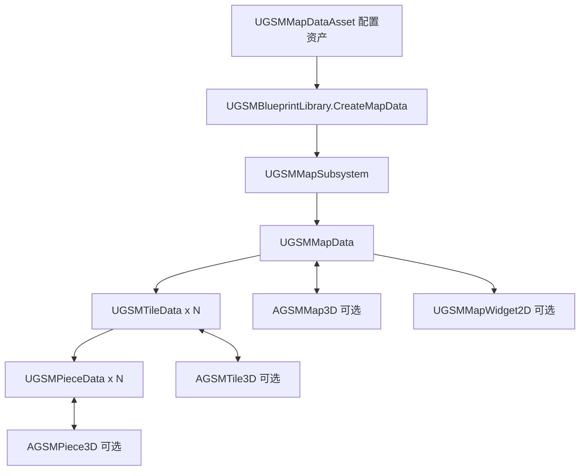

# GSM Grid Strategy Map System

`GridStrategyMapSystem` 是面向 Unreal Engine 5.8 的网格策略地图插件。当前版本以 `GSM` 为统一类名前缀，并将地图的**权威数据**与 2D/3D **展示对象**彻底分离。

本文档是插件的权威说明。离线 HTML 入口为 [说明文档.html](说明文档.html)。

## 核心原则

- `UGSMMapData`、`UGSMTileData` 与 `UGSMPieceData` 是运行时权威数据；它们不依赖 3D 地图是否存在。
- `AGSMMap3D`、`AGSMTile3D`、`AGSMPiece3D` 只负责显示、交互和路径箭头。
- 地图使用 `FGuid` 标识；瓦片仍使用位置组成的 `FName`，默认格式为 `Tile_X_Y`；棋子使用玩家指定或自动生成的 `FGuid`。
- 一张 `UGSMMapData` 同一时刻只能注册一个 `AGSMMap3D`。
- 读档、换档或重开地图前，应清空旧地图数据。清空后外部保留的旧对象引用会变为“无效对象”，而不是继续携带过期状态。



## 模块与目录

| 目录 | 责任 | 主要类型 |
| --- | --- | --- |
| `Data` | 配置、运行时权威数据、查找、寻路、棋子增删改移与生命周期 | `UGSMMapSubsystem`、`UGSMBlueprintLibrary`、`UGSMMapData`、`UGSMTileData`、`UGSMPieceData`、`UGSMMapDataAsset` |
| `Display3D` | 3D 网格、瓦片、棋子、棋盘、路径箭头与世界交互 | `AGSMMap3D`、`AGSMTile3D`、`AGSMPiece3D`、`AGSMPathArrow3D`、`UGSMBoardMeshComponent` |
| `Display2D` | 2D 地图绑定与棋子事件转发 | `UGSMMapWidget2D`、菜单控件类型 |
| `GridStrategyMapSystemEditor` | 编辑器内的地图配置生成与辅助工具 | `UGSMEditorToolSubsystem`、`SGSMEditorWidget` |

## 身份与有效性

| 对象 | 身份 | 有效性检查 | 说明 |
| --- | --- | --- | --- |
| 地图 | `FGuid MapGuid` | `IsMapDataValid` | 子系统保存默认地图的直接引用，其余地图保存在 GUID Map 中。 |
| 瓦片 | `FName TileId` | `IsTileDataValid` | 未填写时由坐标生成 `Tile_X_Y`。同一地图内必须唯一。 |
| 棋子 | `FGuid PieceGuid` | `IsPieceDataValid` | 传入无效 GUID 时自动生成；数据对象还记录所属地图、瓦片和瓦片数据对象。 |

不要用 3D Actor 作为存档身份，也不要把 `MapId` 当作运行时地图数据身份。`MapId` 仍可供场景展示/兼容入口使用；新玩法逻辑应使用 `MapGuid` 与 `TileId`。

## 快速接入

### 1. 创建地图配置资产

创建 `UGSMMapDataAsset` 或其蓝图数据资产，并至少配置：

- `TileEntries`：每个条目包含格子坐标、瓦片 ID、导航配置，以及可选的瓦片 3D 类和瓦片数据类。
- `MapDataClass`：可选。需要给地图增加游戏字段时，创建 `UGSMMapData` 蓝图子类并在此指定。
- `DefaultTileDataClass`：可选。需要在瓦片上保存占领、地形、建筑或单位列表等数据时，创建 `UGSMTileData` 蓝图子类并在此指定。
- `DefaultPieceDataClass` 与 `DefaultPiece3DClass`：用于未在添加棋子时显式传入类的默认值。
- `DefaultTileActorClass`：3D 瓦片展示默认类；没有设置时使用插件设置中的默认类。
- `EditorGridRows` 与 `EditorGridColumns`：地图的固定四边形网格数量。每个瓦片基础尺寸固定为 `100 x 100`，不再由资产自动计算或单独配置。
- `HorizontalLabelType` 与 `VerticalLabelType`：分别选择字母或数字标签，`TileId` 始终由横向标签和纵向标签直接拼接。
- `DefaultViewCenter`：从 1 开始的默认中心格坐标；例如 `(3,3)` 表示第三列第三行，在默认字母列/数字行标签下即 `C3`。`(0,0)` 表示整张地图中心。
- `DefaultViewScale`：归一化初始缩放。`1` 会完整展示全部瓦片；数值越大，瓦片显示越大。
- `WholeMapTerrainMesh`：唯一的地形来源，使用网格体自身材质并按后续地形参数适配地图范围。

`UGSMMapDataAsset` 只定义结构和默认展示类，不保存运行时棋子、瓦片状态或当前路径。

### 2. 在进入游戏时创建地图数据

在 GameInstance 初始化、关卡管理器或你的游戏流程蓝图中调用：

```text
UGSMBlueprintLibrary::CreateMapData
    WorldContextObject
    MapDataAsset
    bSetAsDefaultMap
    OutMapData
-> MapGuid
```

规则如下：

- `bSetAsDefaultMap = true`：新地图进入默认槽位；若已有默认地图，旧默认地图会被深度清理，并记录警告日志。
- `bSetAsDefaultMap = false`：新地图放入 GUID Map；但默认地图为空时，它会自动提升为默认地图，避免默认槽位无效。
- 默认地图适合高频访问；非默认地图必须通过 `MapGuid` 查询。

### 3. 绑定 3D 地图

将 `AGSMMap3D` 或其蓝图子类放入场景。它在启动时向 `UGSMMapSubsystem` 注册，并从 `UGSMMapData` 创建和绑定 3D 瓦片。

- `bUseDefaultMapData = true`：绑定默认地图数据。
- `bUseDefaultMapData = false`：设置 `MapGuid`，绑定指定地图数据。
- `LoadMapFromData`：按已创建的地图数据加载 3D 地图。

`AGSMMap3D` 不是创建权威地图数据的入口。先创建数据，再让 3D 地图注册和展示它。

### 4. 绑定 2D 地图

创建 `UGSMMapWidget2D` 的蓝图子类，调用 `SetMapData(MapData)`。

控件会绑定瓦片的棋子事件，触发以下蓝图事件：

- `ReceiveMapDataLoaded`
- `RefreshMap2D`
- `ReceivePieceAdded2D`
- `ReceivePieceUpdated2D`
- `ReceivePieceRemoved2D`

地图被深度清空时，控件会自动解除引用。当前插件保留 2D 事件和数据绑定，不提供通用 2D 瓦片实例化实现。

## 地图与瓦片数据

### `UGSMMapSubsystem`

它是 `UGameInstanceSubsystem`，负责地图注册、默认地图快速访问、非默认地图 GUID 查询、3D 地图注册以及全局清理。

常用函数：

| 函数 | 用途 |
| --- | --- |
| `CreateMapData` | 从配置资产创建运行时地图并返回 `MapGuid`。 |
| `GetDefaultMapData` | 获取默认地图。 |
| `GetMapDataByGuid` | 获取指定地图。 |
| `GetTileData` | 按地图 GUID 与瓦片 ID 查询瓦片数据。 |
| `FindPathByMapGuid` / `FindPathOnDefaultMap` | 在数据层寻路，不依赖 3D 地图。 |
| `RemoveMapData` / `RemoveMapDataObject` | 深度删除一张已注册地图。 |
| `ClearDefaultMapData` | 深度清空默认地图。 |
| `ClearAllMapData` | 深度清空全部地图；读档前的推荐入口。 |

### `UGSMMapData`

地图数据对象创建时会为配置资产中的每个 `FGSMTileEntry` 创建一个 `UGSMTileData`。它拥有：

- 按 `TileId` 与 `FIntPoint GridCoordinate` 的瓦片查询。
- 按 `PieceGuid` 的棋子查询。
- 数据层寻路：`FindPathByTileIds`、`FindPathByTiles`。
- 棋子增删改移与 `ClearAllPieceData`。
- `ClearAllData` 与 `OnMapDataCleared`。

寻路返回 `FGSMPathResult`，其中的 `PathTiles` 是 `UGSMTileData`，不是 3D 瓦片 Actor；没有 3D 地图时同样可用。

### `UGSMTileData`

瓦片数据对象是适合由项目蓝图扩展的持久游戏状态位置。推荐把格子上的单位、建筑、地形阶段、所有权、可见性或自定义玩法状态放在它的蓝图子类中。

棋子事件：

- `OnPieceAdded(PieceData, Placement)` / `ReceivePieceAdded`
- `OnPieceUpdated(PieceData)` / `ReceivePieceUpdated`
- `OnPieceRemoved(PieceData)` / `ReceivePieceRemoved`

瓦片与其当前的 `AGSMTile3D` 会互相弱引用；展示销毁不会删除瓦片数据。

## 棋子数据工作流

棋子必须先以 `UGSMPieceData` 的形式存在，再由已绑定的 3D/2D 瓦片响应事件创建或刷新展示。

### 添加

使用 `UGSMMapData::AddPieceToTileById` 或 `AddPieceToTile`。传入：

- 目标瓦片 ID 或瓦片数据对象。
- `RequestedPieceGuid`：无效时自动生成。
- 可选的 `PieceDataClass`、`Piece3DClass`。
- `FGSMPiecePlacement`：相对瓦片 XY、Yaw 和缩放。

函数返回最终棋子 GUID，并通过 `OutPieceData` 返回完整棋子数据。不要直接在场景中 Spawn `AGSMPiece3D` 来表示游戏状态。

### 更新、移动、删除

| 操作 | 推荐函数 |
| --- | --- |
| 更新展示类或放置参数 | `UpdatePiece` |
| 按棋子 GUID 移动 | `MovePieceByGuidToTileId` / `MovePieceByGuidToTile` |
| 按棋子数据移动 | `MovePieceDataToTileId` / `MovePieceDataToTile` |
| 删除 | `RemovePieceByGuid` |

移动只需要目标瓦片和新的 `FGSMPiecePlacement`；不需要调用方提供原瓦片。移动或更新会驱动瓦片事件，因此已存在的 3D/2D 展示会同步刷新。

## 3D 展示与交互

### `AGSMMap3D`

`AGSMMap3D` 负责切出 3D 瓦片、缩放、拖拽、地图范围、点击与路径箭头。数据寻路仍应优先通过 `UGSMMapData` 或子系统调用。

地图缩放使用归一化语义：公开缩放值 `1` 对应当前凹槽内完整展示全部瓦片所需的实际适配倍率，后续缩放值在该倍率上继续放大。默认中心格会尽量对齐凹槽中心；若目标格靠近地图边缘，约束逻辑会优先避免因平移产生额外留白，因此边缘格不一定能被强制放到正中央。

- 缩放：`AddZoomAtWorldLocation`、`SetMapScaleAtWorldLocation`。
- 拖拽：`BeginDragMapWithMouse`、`DragMapToMousePosition`、`EndDragMap`。
- 瓦片查询：`GetTileById`、`GetNearestTile...` 等 3D 交互入口。
- 路径显示：配置 `PathArrowActorClass`，或直接使用 `AGSMPathArrow3D`。
- 棋盘/地形：`UGSMBoardMeshComponent`、整体地形或瓦片静态网格均由地图与瓦片 3D 类负责。

### `AGSMTile3D` 和 `AGSMPiece3D`

`AGSMTile3D::BindTileData` 将展示瓦片与数据瓦片连接。数据侧新增、更新、删除棋子时，会调用：

- `OnTileInitialized(InitializedTileData)`：3D 瓦片基础初始化完成，且瓦片与数据对象成功建立双向绑定后触发。蓝图可重载“当3D瓦片初始化完成”，此时 `GetTileData()` 有效，数据对象的 `GetTile3D()` 也会返回当前瓦片；适合执行首次展示更新，避免在瓦片 `BeginPlay` 中读取到空数据。
- `UpdateTile3D`：统一更新入口，可由蓝图瓦片子类重载；父实现刷新基础瓦片表现和已有棋子变换。`AGSMMap3D::NotifyAllTilesUpdate` 会遍历当前地图全部有效瓦片并调用该入口。
- `OnPieceDataAdded(PieceData, RelativeTileXY, RelativeTileYaw)`
- `OnPieceDataUpdated(PieceData)`
- `OnPieceDataRemoved(PieceData)`

项目可在 `AGSMPiece3D::ReceivePieceDataBound` 和瓦片的上述事件中定制网格、动画、材质或单位表现。所有展示 Actor 都是可重建的派生状态，不能作为存档来源。

### 3D 棋子排队工具

`UGSMPiecePlacementBlueprintLibrary` 是仅面向 3D 展示位置计算的蓝图函数库：

- `CalculateCenteredQueueWorldLocations`：以瓦片中心为中心，按棋子数量、最大列/行、间隔和排队角度返回世界位置。沿用旧版紧凑布局规则，最后不足一整行时会让该行单独居中。
- `CalculateEdgeQueueWorldLocations`：选择瓦片首行的起点角和终点角、换行方向、每行最大数量和最大行数。首行槽位间距及换行间距会按瓦片可用范围自动计算；不足一行的剩余棋子从起点方向继续占用槽位。
- `CalculateMapTerrainWorldZAtXY`：接收完整三维世界位置，使用其中 XY 对当前缩放后的整体地形网格体做三角形插值，输出地形世界 Z；可直接传入排队结果，无需拆分或转换向量。

排队函数最多返回 `一行最大棋子数 × 最大棋子行数` 个位置。它们会应用瓦片旋转、瓦片 Actor 缩放和地图当前缩放，但只负责平面布局，Z 使用瓦片自身高度。需要贴合地形时，把每个排队位置传给地形 Z 节点；可在该节点使用“高度偏移”避免棋子底部穿入地表。

## 导航

导航数据位于 `FGSMTileNavigationSettings`：

- 步行通行与进入代价。
- 显式道路连接与双向道路；存在公路连接即代表该连接可供公路导航，不再使用额外的“可公路通过”布尔值。
- 飞行模式的相邻逻辑；是否要求可步行终点由 `UGSMSettings::bFlyingNavigationRequiresWalkableGoal` 决定。

`UGSMNavigationMoveData` 可由蓝图继承，用于把寻路结果与项目自定义移动参数绑定在一起。它保存路径瓦片 ID 与瓦片数据对象，并在路径更新或清空时发出蓝图事件。

## 清理、读档与生命周期

读档前的推荐流程：

```text
ClearAllMapData
    -> 读取存档配置和玩法状态
    -> CreateMapData
    -> 重建瓦片/棋子数据
    -> 让 AGSMMap3D 或 UGSMMapWidget2D 重新绑定
```

`ClearAllMapData`、`ClearDefaultMapData`、`RemoveMapData` 都是深度操作：

1. 从子系统的默认槽位、GUID Map 和活跃 3D 地图注册表移除地图。
2. 移除所有棋子，并通知 3D/2D 展示。
3. 解绑并销毁相关 3D 瓦片展示。
4. 清空瓦片数据和棋子数据容器。
5. 广播 `OnMapDataCleared`，使 2D 地图解除引用。
6. 使旧地图、瓦片、棋子对象的 ID、所属关系和展示引用失效。

旧 UObject 引用并不会立刻变成空指针；请在缓存或异步回调中使用 `IsMapDataValid`、`IsTileDataValid`、`IsPieceDataValid` 检查。失去引用后由 Unreal GC 回收。

## 扩展建议

- 需要玩法字段时，优先继承 `UGSMMapData`、`UGSMTileData`、`UGSMPieceData`，不要把持久状态写进 3D Actor。
- 在 `UGSMMapDataAsset` 的默认类或单瓦片覆盖中指定这些子类。
- 以 `MapGuid + TileId + PieceGuid` 设计存档键；重建时先创建地图，再恢复棋子与项目自定义字段。
- 需要多张地图时，为非默认地图保留 `MapGuid`；一个地图数据对象只能连接一个 3D 地图。
- 新代码只使用 `GSM` 前缀类型。遗留的 `GridStrategyMap*` 兼容入口不再是推荐 API，不应成为新蓝图或 C++ 依赖。

## 编辑器、棋盘与右键菜单

`UGSMEditorToolSubsystem` 是编辑器专用入口，可通过 Editor Utility Blueprint/Widget 的 “Get Editor Subsystem” 获取。它提供：

- `GenerateRectangularSquareMap`：按固定 `100 x 100` 瓦片尺寸生成矩形四边形网格。
- `AutoFillWalkingNeighbors`：从格子坐标填充步行邻接。
- `AddBidirectionalRoadConnection`：创建双向道路连接。
- `ValidateMapConfig`：检查重复瓦片 ID、重复坐标和导航引用；应在提交配置资产前运行。

插件地图编辑器左侧使用带横纵标签的滚动表格展示瓦片，右侧分为可折叠的“地图配置”和“瓦片配置”。“单行网格数量”控制横向列数，“单列网格数量”控制纵向行数；修改后使用默认缩放下方的“重建网格”刷新左侧按钮。重建会把新瓦片和仍继承上一次默认类型的瓦片更新为当前默认瓦片数据类与默认 3D 瓦片 Actor 类，单瓦片明确指定的其它类型不会被覆盖。Ctrl 单击用于逐个增减选择，Shift 单击选择锚点与目标之间的矩形区域；多选时可以批量设置是否可步行。选中单个瓦片可编辑显示名称、数据类覆盖、3D Actor 类覆盖及导航数据。瓦片 ID 和本地位置由坐标与固定尺寸生成，不在面板中直接编辑。

`UGSMBoardMeshComponent` 只生成有边框和凹槽的棋盘底座。`AGSMMap3D` 可使用其凹槽范围作为地图范围；它不保存瓦片、地图或棋子数据。

瓦片右键菜单仍属于 3D 展示交互：

- 继承 `UGSMTileContextMenu`，并在蓝图根布局中提供名为 `MenuButtonVerticalBox` 的 `VerticalBox`。
- 继承 `UGSMTileMenuButton`，在 `OnMenuContextAssigned` 更新可见状态，在 `OnClickMenuButton` 处理玩法命令。
- 菜单上下文提供触发瓦片、所属 3D 地图、玩家控制器、世界命中位置和屏幕位置。需要权威数据时，从瓦片 3D 的 `GetTileData` 再进入数据层。

## 验证

插件包含 `GSM.Data` 自动化测试，覆盖地图创建、数据层寻路、棋子生命周期和深度清理。运行：

```powershell
& 'C:\Program Files\Epic Games\UE_5.8\Engine\Binaries\Win64\UnrealEditor-Cmd.exe' `
  'D:\UE_workspace\SilverChoir\SilverChoir.uproject' `
  -ExecCmds='Automation RunTests GSM.Data; Quit' `
  -unattended -nop4 -nosplash -NullRHI -TestExit='Automation Test Queue Empty' -log
```
